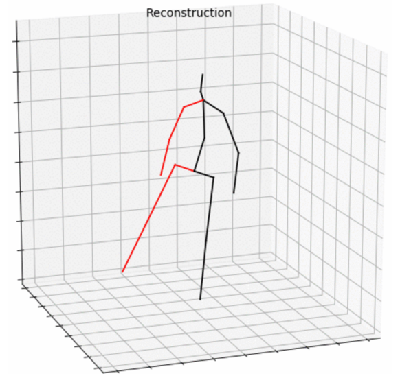

# Pose Estimation

Pose estimation project compares Detectron VideoPose3D, OpenPose and the stereo algorithm that uses a triangulation method to predict keypoints used in physiotherapy.The data is obtained from Kinect cameras and converted to ```.npy``` files to use in pose estimation.

## Image pose estimation

Sensors are expensive and require installation to estimate keypoints. Therefore, we used Kinect v1 cameras for human pose estimation.

## Kinect

The Kinect version 1 camera uses infrared. These waves do not pass through plastic. It has a lower accuracy than deep learning and sometimes we encounter jumps in the estimation of images, but there is no jump in the human sketch of the 3D project. Kinect 1 can track 2 people, and Kinect 2 can track more than 6 people. The space around Kinect is effective in estimating body skeleton. It is limited to the indoor space. Kinect 1 evaluates the distance of 0.4-4.5 meters. Kinect 2 evaluates the distance of 0.5-8 meters.


## Datasets

1. **Detectron** Human dataset 3.6m dataset

Detectron project is trained on Human dataset 3.6m. 15 sensors have been used to collect this dataset, which are as follows:

* 4 digital video cameras
* 1 time-of-flight sensor
* 10 motion cameras

The data of this dataset consists of 15 movements for training, such as walking and a number of asymmetric movements (walking with one hand in the pocket and walking with a bag on the shoulder), sitting and various types of waiting situations and other types of movements.
The target area for video capture was approximately 5m x 6m and within this area there was an effective area of ​​4m x 3m where the specimens were fully visible to all cameras.
For compatibility and convenience, 32 points are used for all parameterizations. During testing, we reduce the number of related joints, for example, we consider only one point for each hand and each leg. In this dataset, the two-dimensional coordinates of the points is also provided.
2. **OpenPose** body_25, PII, LSP and FLIC datasets

Here you can see the keypoints from body_25 dataset.


3. Sampling with webcam
It is possible to record webcam videos with debut video capture software or iPi Recorder 4. It should be noted that Logitech has not made the SDK for webcams available to the public. The specifications of the Logitech webcam that was used for sampling is shown in the table:


4. Sampling with a VR camera using Opencv
5. In this project, 2 RGB videos are received from Kinect cameras that are parallel to each other.
For sampling, two Kinect version 1 cameras have been used on the same level and in parallel, and the distance (```T=0.28m```) between them has also been calculated. Using the iPi Recorder 4 software to simultaneously capture several videos from the Kinect version 1 and 2 cameras and the cameras It can be used like a camera on a laptop. In this software, the background is evaluated first and then the videos are recorded.

The samples taken include the following:

* Moving the hands horizontally
* Moving hands vertically
* Moving the legs horizontally
* Moving the legs vertically
* Walking horizontally
* Walking vertically
* The second example of walking horizontally
* The second example of walking vertically

The output of the iPi Recorder 4 software is a file with the extension .iPiVideo that stores several recorded videos in one file. Then the video samples of the first Kinect camera and the second camera are separated with the iPi Mocap Studio software.

## Facebook research VideoPose3D

The facebook research videoPose3D project was conducted by Facebook for Research and presented at Conference on Computer Vision and Pattern Recognition (CVPR) 2019. The 3D project extracts joints from video or photo using temporal convolution and semi-supervised method for training.
The 3D points are then converted back to the 2D input (back projection).
3D joints in video can be effectively obtained with a convolution model based on temporal dilated convolution on 2D points. Also, back projection is introduced as a simple and effective semi-supervised learning method for unlabeled videos. This method is suitable when labeled data is scarce.
The convolution model enables parallel processing of several frames, which is not possible with recurrent networks. Compared to RNN-based approaches, higher accuracy, simplicity and efficiency are obtained both in terms of calculations and in terms of the number of parameters.


The temporal convolution model receives a sequence of two-dimensional joints as input and produces a three-dimensional estimate. To obtain information in a long sequence, dilated convolution is used.

## temporal dilated convolution

### Better results than RNN

This project does not use a heatmap. This model is a completely convolutional architecture with residual connections that takes a sequence of two-dimensional input poses and transforms them through temporal convolution. Convolutional models enable parallelization in the category and time dimension, while RNNs do not run in parallel in time. In the convolution model, the path between the input and output gradients has a fixed length regardless of the length of the sequence. In this way, the problem of vanishing gradient and gradient explosion, which affects RNN, is solved. Also, in the receptive field convolution model can be accurately controlled, which is useful for modeling temporal dependencies for 3D estimation. In addition, dilated convolution is used to model temporality long-term dependencies, while maintaining efficiency.
Convolution models usually perform zero layering and their input and output numbers are equal. In this project, unpadded convolution and layering the input sequence with copying the boundary values ​​on the left and right has shown better results.

### Vanishing gradient and gradient explosion

As the distance of long-term dependence increases, RNN neural networks face more problems in learning these dependencies because they either face the problem of vanishing gradient or gradient explosion.
The gradients, after spreading from the end of the network to the beginning of the network during the training of a deep network, go through multiple multiplications and gradually their values ​​become very small (less than 1) and the training is stopped because the gradient values ​​are small and do not change the weights. This problem is called vanishing gradient.
In the same way, the gradient values ​​may become so large over time that the model suffers an error and overflow occurs in the calculations. This problem is called gradient explosion. One of its symptoms is receiving the (not a number) NAN error in PyTorch.

## Semi-supervised approach

The semi-supervised method has been used to increase the accuracy when the real 3D pose data is scarce. The Encoder (pose estimator) estimates the 3D points from the 2D points, and the decoder (projection) layer projects the 3D points to the points and returns two-dimensional data. During training, if the two-dimensional points are too far from the main input, a penalty is applied.
For labeled data, real 3D pose data is used to train a supervised error function. Unlabeled data is used to implement an automatic error encoder when returning 3D poses to 2D poses and checking compatibility with the input. A soft constraint is applied to match the mean bone length of labeled and unlabeled data.
Back projection is a semi-supervised learning method to improve performance when labeled data is scarce. This method only requires internal camera parameters, which makes it applicable to scenarios where motion capture is challenging. This image shows the semi-supervised learning with two-dimensional pose as input (WMPJPE: weighted MPJPE).


## Strided convolution

Classification depends on the ```--stride``` value. The stride values ​​from left to right are 1, 2, and 4 respectively. This example shows a sequence of two-dimensional states where the number of frames is N=8. Three-dimensional states (blue circles) are inferred with a model with an receptive field of ```F = 5```. Because of valid layering, the length of the output sequence is ```N - F + 1```
will be.


When ```stride = 1```, an example is created for each frame in training. By doing this, we make sure that the categories have the maximum uncorrelatedness. If the stride is increased, the training of the network becomes faster because the model can perform intermediate calculations. This is at the cost of biasing the categories. During network training, if the category size is 1 (```stride = 1```), an optimal implementation is implemented that replaces dilated convolution with strided convolution.
If the size of the category is larger, the speed will increase, but some features in that category will be ignored.


The picture above shows a model with a receptive field of 27 frames. An output frame is created from these 27 input frames. This implementation makes some intermediate results to be ignored when a small number of frames are predicted. However, this approach is highly efficient for a long sequence of frames because intermediate results are shared between successive frames.


Therefore, the above implementation is only used to train the network, which uses Strided convolution instead of delayed convolution. This implementation produces the same results but avoids the unnecessary calculation of intermediate results.

## Symmetric convolution versus causal convolution

The image below shows the flow of information from the input at the bottom to the output at the top. A model with 27 receptive field is used. This image shows a symmetrical convolution. Previous and next frames are used to get a better result in image reconstruction.


The figure below shows convolution using previous frames. This approach is suitable for real-time software because future information cannot be exploited. The cost of this error approach is slightly higher.


This table shows Kinect joints corresponding to the 3D project joints. The HipCenter joint is estimated differently in the 3D project and the Kinect camera. Also, the jaw joint is estimated in the videopose3d project, but it is not estimated with Kinect.


Here you can see a skeleton example in Kinect:


This image shows the body skeleton in the 3D project:



## OpenPose project

The OpenPose project is a deep learning project for inferring the two-dimensional coordinates of a video and it was presented in CVPR 2017. The body_25 dataset is used.

This project is also used to derive 3D coordinates. I used the VideoPose3D project because it is more accurate. It can also be used to identify and estimate the points of the face and hands and calibration (simple estimation of the camera intrinsic and extrinsic parameters and distortion) used it.

In this project, 25 points are detected. It detects more points than the videopose3d project in the person's face and hands. It implicitly models long-range dependencies between variables in structured prediction tasks such as estimating human poses by designing a sequential architecture consisting of convolutional networks that directly operate on belief maps from previous steps. openPose achieves this problem without needing to infer explicit graphic style. This approach addresses the characteristic difficulty of gradient reduction during training by providing a natural learning objective function that creates intermediate monitoring, thereby reproducing the propagated gradient and smoothing the learning procedure.

The advantages of convolution architecture are:

* Ability to learn feature representations for image and spatial context directly from data.
* An architecture that provides the possibility of training joints with back propagation.
* Ability to efficiently handle large training data sets.

A sequence of convolutional networks that iteratively produces 2D belief maps for the location of each part. We learn convolutional networks that work directly with intermediate belief maps and spatial models that learn implicit image-independent relationships between parts.

At each step belief maps are generated with increasingly refined estimates for locations for each episode. In order to achieve long-range interactions between components, the network design at each stage of our sequential prediction framework is motivated to achieve a large receptive field in both mental images and belief maps.

### Convolutional pose machines (CPM)


The pose machine is shown in a and b. The convolutional network is shown in c and d. The architecture of the later stages works on both visual evidence and belief maps from the previous stages. The network is locally monitored after each step using an intermediate layer that prevents vanishing gradient during training. A large receptive field enables this model to capture a wide range of long-range spatial dependencies, such as those between the head and the knees.

This design for a CPM combines the advantages of a deep convolution architecture with the implicit spatial modeling achieved by the state machine framework.

### Locating points using local image evidence

The first stage of a convolutional state machine predicts the belief map from only local image evidence. The evidence is local because the receptive space of the first stage of the network is limited to a small patch around the output pixel. It consists of a network structure consisting of 5 convolution layers and 2 (1 * 1) convolution layers, which gives a fully convolutional architecture.


Location content from belief maps of parts that are easier to recognize provide accurate information for locating parts that are harder to recognize. Location content from the shoulder, neck, and head can help eliminate errors (red) and strengthen the correct estimation of the right elbow (green) on the belief map.

When detecting challenging parts such as the right elbow, the belief map for the right shoulder with a sharp peak can be used as a strong cue.

### Sequential prediction with spatial learning of text features

Accuracy is typically much lower for markers lower in the human skeletal chain due to the large variation in configuration and appearance.

The design of the network is driven by achieving a receiver in the output layer of the second stage of the network that is large enough to allow for complex learning and long-range correlations between components.


A network with a large receiver is effective in modeling the interaction between parts in the long-range range. Increasing the size of the receiver can be done by increasing the number of convolution layers, but it is possible to face vanishing gradients during training. We choose to use multiple layers of convolution to achieve 8x large receptivity of heatmaps. We find that the ```stride = 8``` grid performs as well as the ```stride = 4``` (even at high accuracies), while making it easier for us to achieve larger receptive fields.

## Stereo method

To estimate the depth from two 2D movies, I used the stereo triangulation method. In this method, two Kinect cameras produce movies in parallel. With this method, we can establish a relationship between the distance of the points from each other and the depth of the desired point in the real world.


With these relationships,the disparity for each point in each frame of two movies is calculated.
Then similar triangles in the picture above are detected and the depth of the points is obtained.


Using the json library and jsf.read() and json.loads() functions, the two-dimensional coordinates of the points from the files are read. Then, using the ```coefficient = 0.0002645833``` the x, y, z coordinates from pixels are converted to meters. Also, the focal distance of Kinect RGB camera from 525 pixels is converted to 0.13890625 meters.

## Installation

For this project, an Ubuntu OS version 18.04 is installed. Follow the steps below to install other dependencies:

Install Anaconda

```bash
sudo sh <AnacondaFileName>.sh
```

Inspect whether the system has a suitable GPU for cudatoolkit.

```bash
lspci | grep -i nvidia
```

Install Driver with one of the instructions below:

```bash
sudo apt install nvidia-435
```

```bash
sudo ubuntu-drivers autoinstall
```

Ensure driver installation with one of these instructions:

```bash
lspci -k | grep -A 2 -i "VGA"
```

```bash
nvidia-smi
```

```bash
nvidia-settings
```

Install cudatoolkit with one of these instructions:

```bash
sudo sh cuda_<version>_linux.run
```

```bash
sudo apt-get install cuda
```

Export path variables

```bash
export LD_LIBRARY_PATH=${LD_LIBRARY_PATH}:/usr/local/cuda-10.0/lib64
export PATH=${PATH}:/usr/local/cuda-10.0/bin
```

Install cudnn

```bash
sudo dpkg -i cudnn.deb
```

Install ffmpeg and imagemagick

```bash
sudo apt install ffmpeg
ffmpeg –version

sudo apt install imagemagick
ffmpeg -i input.mp4 output.avi
```

### 3D project installation

Create an environment with conda in anaconda

```bash
conda create --name my_env python=3.7
conda activate my_env
```

Install pythorch gpu version

```bash
conda install pytorch torchvision cudatoolkit=10.0 -c pytorch
```

Install matplotlib and numpy

```bash
conda install matplotlib=3.0.3 numpy=1.16.1 
```

### Detectron project installation

Create environment

```bash
conda create --name my_env python=2.7
```

Install caffe which is needed for Detectron version 1.

```bash
conda install pytorch-nightly -c pytorch
python -c 'from caffe2.python import core' 2>/dev/null && echo "Success" || echo "Failure"
python -c 'from caffe2.python import workspace; print(workspace.NumCudaDevices())'
```

Retrieve COCOAPI project

```bash
git clone https://github.com/cocodataset/cocoapi.git
```

Run the installation command in the path related to the project in the PYTHONAPI path.

```bash
make install
```

Retrieve Detectron project

```bash
git clone https://github.com/facebookresearch/detectron
```

install Detectron dependencies

```bash
pip install -r $DETECTRON/requirements.txt
```

Run the project installation command in the path of the project and ensure the installation.

```bash
make
python $DETECTRON/detectron/tests/test_spatial_narrow_as_op.py
```

Copy the inference/infer_video.py file from the videopose3d project to the tools folder.

## Run

### Run Detectron VideoPose3D

You can run the three-dimensional videopose3d project (Inference in the wild) as follows. To deduce all the videos in the input_directory, you should use this code. The output in the output_directory will be in the form of numpy archives (```.npz```).

```bash
python tools/infer_video.py \
    --cfg configs/12_2017_baselines/e2e_keypoint_rcnn_R-101-FPN_s1x.yaml \
    --output-dir output_directory \
    --image-ext mp4 \
	--wts https://dl.fbaipublicfiles.com/detectron/37698009/12_2017_baselines/e2e_keypoint_rcnn_R-101-FPN_s1x.yaml.08_45_57.YkrJgP6O/output/train/keypoints_coco_2014_train:keypoints_coco_2014_valminusminival/generalized_rcnn/model_final.pkl \
    input_directory

```

 Creating a dataset in the data path. The code creates a dataset named ```myvideos``` and stores it in the ```data_2d_custom_myvideos.npz``` file.

 ```bash
python prepare_data_2d_custom.py -i /path/to/detections/output_directory -o myvideos
```

Rendering and getting the output as a numpy archive
Use this code to render a desired movie. The output is a gif file that displays the body sketch. Also, the coordinates of the joints are stored in .npy files.

```bash
python run.py -d custom -k myvideos -arc 3,3,3,3,3 -c checkpoint --evaluate pretrained_h36m_detectron_coco.bin --render --viz-subject foothorizontalright.mp4 --viz-action custom --viz-camera 0 --viz-video foothorizontalright.mp4 --viz-output foothorizontalright.gif --viz-size 6
```

Convert numpy archive files to text files
Using the numpy library and the np.load() function, you can read the information from the numpy archive and then create a text file according to the Kinect record file format. Saving time calculation has been done in this text file using the frame number and that the Kinect cameras recorded the video at a rate of 30 frames per second. This allows the comparison of the results of this project with the Kinect's results.

### Run OpenPose 2D project

Run this code in powershell or command prompt to create json files related to the 3D coordinates of each frame of the movie in the path folder.

```bash
bin\OpenPoseDemo.exe --video finalvideo.mp4 --write_video foothorizontalright.avi --write_images images --write_json path/
```

## Results

OpenPose method is able to control non-standard poses and resolve ambiguities between symmetric parts for different types of relative camera views.


Keypoints detected by the OpenPose project are shown in the table below:


The results have been plotted in 2D points with opencv and 3D points with matlab. This picture shows frame 25 from foothorizontal move.


The Dtectron v1 project has outperformed the OpenPose project with stereo method.

## Lessons Learned

Deep learning 3 dimensional algorithms on image data can outperform sensor data and 2 dimensional algorithms.

## Citation

1. **[3D human pose estimation in video with temporal convolutions and semi-supervised training](https://arxiv.org/abs/1811.11742)** paper from Dario Pavllo et al.

2. **[OpenPose: Realtime Multi-Person 2D Pose Estimation using Part Affinity Fields](https://arxiv.org/abs/1812.08008)** paper from Zhe Cao et al.

3. **[Realtime Multi-Person 2D Pose Estimation using Part Affinity Fields](https://arxiv.org/abs/1611.08050)** paper from Zhe Cao et al.

4. **[Hand Keypoint Detection in Single Images using Multiview Bootstrapping](https://arxiv.org/abs/1704.07809)** paper from Tomas Simon et al.

5. **[Convolutional Pose Machines](https://arxiv.org/abs/1602.00134)** paper from Shih-En Wei et al.

## License

This project is under [GPL-3.0 license](https://choosealicense.com/licenses/gpl-3.0/):

## Feedback

If you have any feedback, please reach out to me at *<aliamani019@gmail.com>*.

## Authors

[@AliAmani](https://github.com/MrAliAmani)
